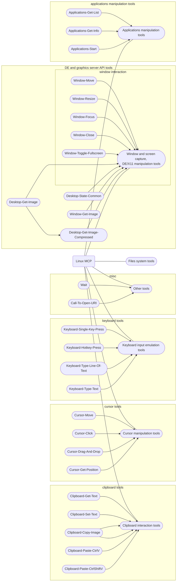

# Linux-MCP
MCP server to provide lots of tools for LLM and Linux integration. 
> [!CAUTION]
> This MCP server provide to LLM tools, that can damage your data or device. **You run this software on your risk!**

## Functionality
> [!WARNING]
> Wayland is not fully supported! Use X11.
### Applications
+ [X] Interact wih GUI applications
+ [ ] Interact with cli applications
+ [X] Get application info (GUI)
### UI Automatization
+ [X] Cursor manipulation
+ [X] Keyboard manipulation
+ [X] Windows manipulation
+ [X] Clipboard interaction
### Filesystem
+ [ ] Read file
+ [ ] Write file
+ [ ] Update file
+ [ ] Copy/paste tool
+ [ ] Move files tool
+ [X] call to open file/folder



## Install
### Ubuntu
> [!WARNING]
> For ubuntu, you need to install [uv](https://github.com/astral-sh/uv) manually!  
```bash
sudo apt update 
sudo apt install python3-full gnome-screenshot imagemagick
# Place application to installation directory
cd /path/to/application/dir
./install.sh # to add Linux-MCP to client applications like Claude-desktop, vscode and other
```

### Fedora
```bash
sudo dnf install python3 uv gnome-screenshot ImageMagick
# Place application to installation directory
cd /path/to/application/dir
./install.sh # to add Linux-MCP to client applications like Claude-desktop, VScode and others
```

### Author: Yaroslav Kuznetsov