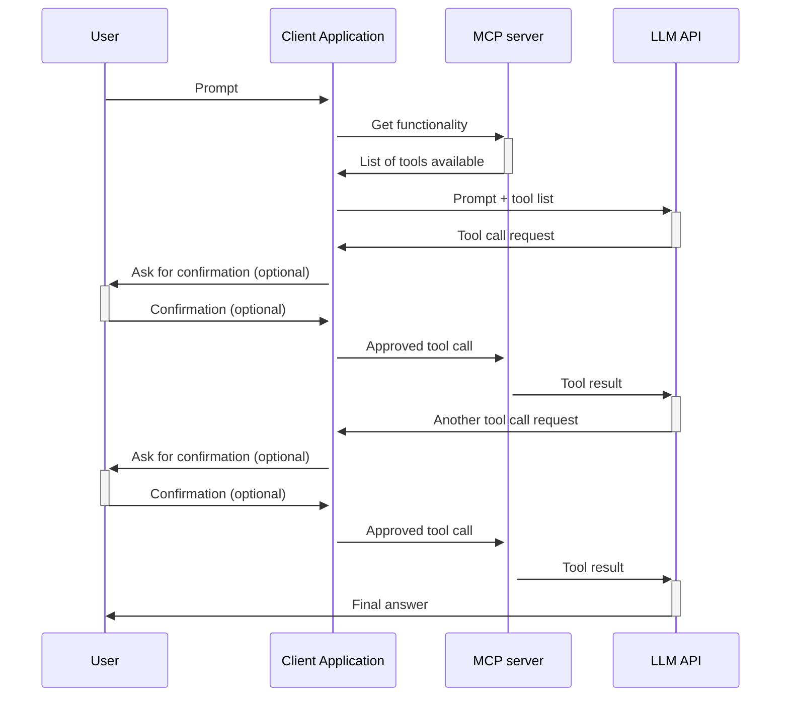

# How Linux-MCP works

This document explains what Linux-MCP does, how the pieces fit together, and how add new functionality. 

For a higher-level container view of the system, see [C4-Container.puml](C4-Container.puml).

## High-level request flow

## Architecture in one paragraph

Linux-MCP is a small core plus a set of plugins. The core registers tools and serves MCP requests. 
Plugins located in `/usr/share/Linux-MCP/plugins/` (sources located at `src/plugins/`) and provide tools. At startup the server scans the plugins directory, imports each plugin(and tools from it). Some plugins guard their registrations behind a session check(X11/Wayland or specific DE), so Linux-MCP works correctly across desktop environments without configuration.

## The plugins

| Plugin           | What it does                                                             | When it activates                                                      |
|------------------|--------------------------------------------------------------------------|------------------------------------------------------------------------|
| `applications`   | List installed apps (`.desktop`), launch apps, run shell commands, list processes | Always                                                                 |
| `clipboard`      | Read and write text and images from/to the clipboard                     | Always                                                                 |
| `filesystem`     | Read, write, update, copy, move files; list directories                  | Always                                                                 |
| `input`          | Cursor and keyboard automation via PyAutoGUI                             | X11 sessions                                                           |
| `wayland_input`  | Cursor and keyboard automation via `wayland-automation`                  | Non-X11 (Wayland) sessions                                             |
| `X11`            | Window manipulation, screenshots, desktop state                          | X11 sessions                                                           |
| `hyprland`       | Window/workspace manipulation, screenshots — via Hyprland's IPC socket   | `HYPRLAND_INSTANCE_SIGNATURE` is set or `XDG_CURRENT_DESKTOP=hyprland` |
| `sway`           | Window manipulation, screenshots — via Sway's IPC socket                 | `XDG_CURRENT_DESKTOP=sway`                                             |

A few cross-cutting tools (`Wait`, `Call-To-Open-URI`) are registered directly by `src/modules/misc.py` rather than by a plugin.

## Inside the core

The `src/modules/` directory holds the parts that aren't tied to a specific session:

- **`init_system.py`** — creates the singleton FastMCP server (`FastMCP(name="Linux-MCP server")`) and exposes it via `get_mcp()`. Plugins import this to grab the same server instance.
- **`misc.py`** — some tools without own plugin.
- **`all_mcp_functions.py`** — historical entry point that re-exports tools; most of its content has been moved out into plugins, leaving only minimal glue.
- **`windows_and_desktop/`** — abstract base classes:
  - `BaseDesktopInfo` — represents the current desktop (displays, list of windows, session type). Has a `find_session_info()` method that reads `XDG_SESSION_TYPE`, `XDG_CURRENT_DESKTOP`, and `DESKTOP_SESSION` to figure out where it's running.
  - `BaseWindow` — represents a single window. Subclasses (`X11Window`, `HyprlandWindow`, `SwayWindow`) live inside their respective plugins and provide protocol-specific implementations of `get_title()`, `get_geometry()`, `get_pid()`, etc.

The base classes make it possible for plugins to return uniformly-shaped data regardless of which display server they're talking to.

## How plugins are discovered

`src/main.py` is the entry point. It does roughly this:

1. Initialise the MCP server (`init()` from `init_system.py`).
2. Import tools from `modules/all_mcp_functions.py`.
3. Walk `/usr/share/Linux-MCP/plugins/` (the install location).
4. For each subdirectory `foo`, import `plugins.foo.tools`. The import alone is enough — every `@mcp.tool(...)`-decorated function inside that module gets registered with the shared FastMCP instance.
5. Hand control to FastMCP, which then serves MCP requests until the client disconnects.

If a plugin's `tools.py` raises during import (e.g. a missing system library), the error is logged and that plugin is skipped — the rest of the server keeps running.

## Things to keep in mind

- **All operations run as your user.** There is no privilege escalation. The LLM can do anything you can do at the terminal — and that's the whole point. Don't run Linux-MCP under an account whose access you don't want to delegate.
- **Environment matters.** Without the right `DISPLAY`, `WAYLAND_DISPLAY`, `XDG_*`, and DBus variables, the server has no way to reach your session. The installer copies these in for clients that need it; for a manual setup see the README.
- **Plugin loading happens at server startup.** Adding a plugin or changing a session variable requires restarting the MCP server (which usually means restarting the client application).
