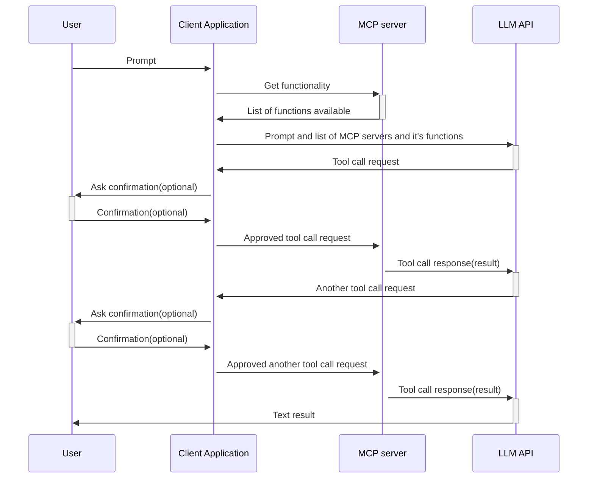

## How application works (High level)

```mermaid
sequenceDiagram
    User ->>+ Client Application: Prompt
    Client Application ->>+ MCP server: Get functionality
    MCP server ->>- Client Application: List of functions available
    Client Application ->>+ LLM API: Prompt and list of MCP servers and it's functions
    
    LLM API ->>- Client Application: Tool call request
    Client Application ->>+ User: Ask confirmation(optional)
    User ->>- Client Application: Confirmation(optional)
    Client Application ->>+ MCP server: Approved tool call request
    MCP server ->>+ LLM API: Tool call response(result) 
    
    LLM API ->>- Client Application: Another tool call request
    Client Application ->>+ User: Ask confirmation(optional)
    User ->>- Client Application: Confirmation(optional)
    Client Application ->>+ MCP server: Approved another tool call request
    MCP server ->>+ LLM API: Tool call response(result)
    
    LLM API ->>- User: Text result
```

